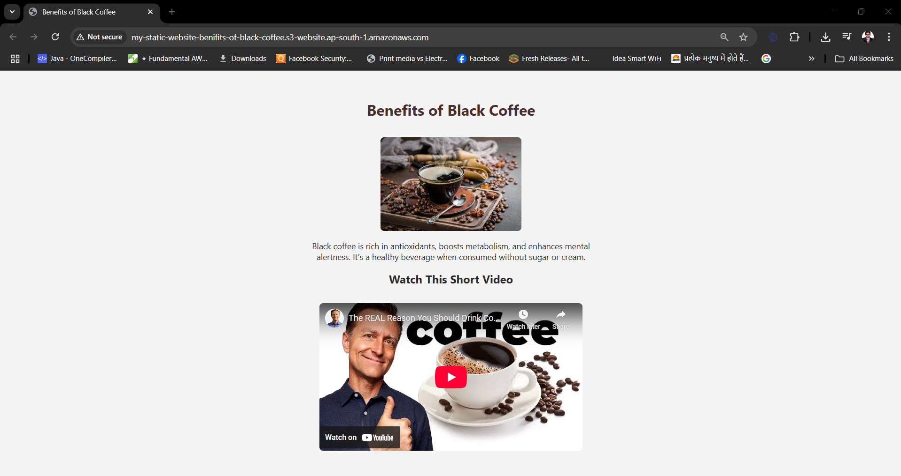
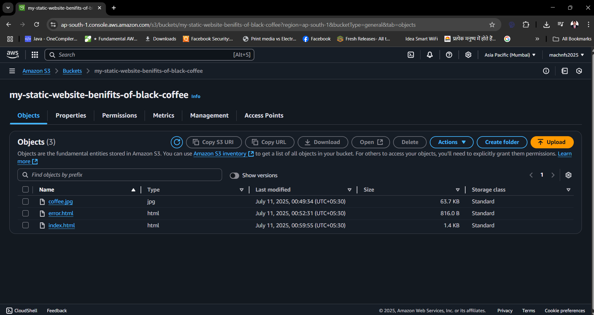

# ☕ Benefits of Black Coffee – Static Website on AWS S3

A simple, beginner-friendly static website hosted on **AWS S3**. This project is about deploying a single-page website with HTML, an embedded YouTube video, and an image. It highlights the health benefits of black coffee and demonstrates practical AWS skills for cloud deployment.

---

## 🔗 Live Demo

👉 [Visit Live Site](http://my-static-website-benifits-of-black-coffee.s3-website.ap-south-1.amazonaws.com/) 

> ⚠️ Hosted via AWS S3 static hosting (HTTP only). For HTTPS, see CloudFront section below.

---

## 🧾 Features

- 🧑‍🍳 Clean HTML page with styled layout
- 📸 Image of black coffee
- 🎥 Embedded YouTube video (`The Real Reason You Should Drink Coffee`)
- ☁️ Hosted publicly on **AWS S3** with static website hosting
- ❌ Custom `404 error.html` page for bad URLs

---

## 🛠️ Technologies Used

| Tech        | Purpose                            |
|-------------|-------------------------------------|
| HTML & CSS  | Web page structure & styling        |
| AWS S3      | Static site hosting                 |
| Git & GitHub| Version control + project showcase  |
| CloudFront (Optional) | HTTPS + CDN distribution |
| Route 53 (Optional)   | Custom domain              |

---

## 📁 Project Structure

├── index.html # Main page with title, image, and video
├── error.html # Custom 404 page
├── coffee.jpg # Image used in the page
└── README.md # This file

---

## 🚀 How to Deploy on AWS S3

### 1. Create an S3 Bucket

- Bucket name (e.g.): `my-static-website-benifits-of-black-coffee`
- Region: Choose closest (e.g., `ap-south-1`)
- Uncheck "Block all public access"

### 2. Enable Static Website Hosting

- Enable in **Properties → Static website hosting**
- Set:
  - `index document`: `index.html`
  - `error document`: `error.html`

### 3. Upload Your Files

Upload:
- `index.html`
- `error.html`
- `coffee.jpg`

### 4. Set Bucket Policy for Public Access

Paste this JSON in the **Permissions → Bucket Policy** tab:
 
json
{
  "Version": "2012-10-17",
  "Statement": [
    {
      "Sid": "PublicReadGetObject",
      "Effect": "Allow",
      "Principal": "*",
      "Action": "s3:GetObject",
      "Resource": "arn:aws:s3:::my-static-website-benifits-of-black-coffee/*"
    }
  ]
}
🔁 Replace my-static-website-benifits-of-black-coffee with your actual bucket name.

## (Optional) Setup HTTPS with CloudFront
To make the site secure (https://), use Amazon CloudFront with a public S3 origin.
Resources:
  CoffeeWebsiteCDN:
    Type: AWS::CloudFront::Distribution
    Properties:
      DistributionConfig:
        Enabled: true
        Origins:
          - DomainName: my-static-website-benifits-of-black-coffee.s3-website-ap-south-1.amazonaws.com
            Id: CoffeeOrigin
            CustomOriginConfig:
              OriginProtocolPolicy: http-only
        DefaultCacheBehavior:
          TargetOriginId: CoffeeOrigin
          ViewerProtocolPolicy: redirect-to-https
          AllowedMethods: [GET, HEAD]
          ForwardedValues:
            QueryString: false
        DefaultRootObject: index.html
        ViewerCertificate:
          CloudFrontDefaultCertificate: true

Use AWS Certificate Manager if you want to connect a custom domain with a real certificate.

💡 Optional Enhancements
| Feature                      | Description                             |
| ---------------------------- | --------------------------------------- |
| 🔒 HTTPS with CloudFront     | Enable secure access with SSL           |
| 🌐 Custom Domain             | Use Route 53 to map `blackcoffee.site`  |
| 📩 Contact Form (Serverless) | Use AWS Lambda + API Gateway            |
| 📊 Additional Sections       | Nutritional info, routine tracker, etc. |
| 🎨 Theming                   | Add dark/light toggle, animations       |
| 📈 Analytics                 | Add Google Analytics or Plausible       |
| 🚀 GitHub Actions            | Auto-deploy S3 site on push to `main`   |

photos of live deployment 
## 🌐 Website UI

## ☁️ AWS S3 Bucket Objects

🧑‍💻 Author
Mahesh Funde

Cloud Enthusiast

Email: maheshnfunde2000@gmail.com

LinkedIn: https://www.linkedin.com/in/mahesh-cloud

